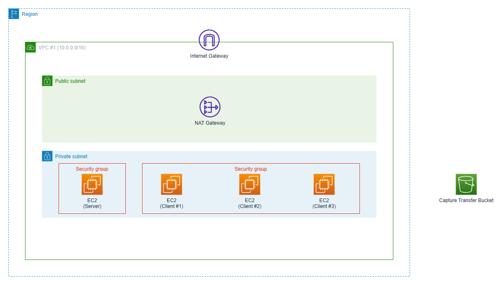

# AWS Infrastructure

## Introduction

Terraform configuration allowing to provision AWS infrastructure that can be used to run the [TCP/IP demo applications](../TCP-UDP). The overall setup is depicted by the following diagram:


The EC2 instances automatically download the Python code from this Git repository during startup. The entire repository is cloned into the `/opt` directory on each instance.

Because AWS does not support broadcast or multicast communication at the VPC level, UDP broadcast and UDP multicast–based applications will not function in this environment. All other applications included in the repository work as expected.

The **EC2 instance labeled as server** in the architecture diagram is intended to run server-side applications, such as:

- [TCP Server](../TCP-UDP/tcp_server.py)
- [UDP Server](../TCP-UDP/udp_server.py)
- [Hesitant Consumer TCP Server](../TCP-UDP/hesitant_consumer_tcp_server.py)

The **EC2 instances labeled as clients** are intended to run client-side applications, such as:

- [TCP Client](../TCP-UDP/tcp_client.py)
- [UDP Client](../TCP-UDP/udp_client.py)
- [Eager Producer TCP Client](../TCP-UDP/eager_producer_tcp_client.py)

The security groups attached to the EC2 instances are configured according to these intended roles. Network traffic is permitted only when instances operate in their designated server or client roles. If you change these roles (for example, by running server applications on a client instance or vice versa), network traffic may be blocked by the security groups.

By **default**, the Terraform configuration assumes that the demo applications use **TCP port 1234** and **UDP port 1234**. These ports are explicitly allowed by the security groups. If you want to use different ports, you must update the corresponding values in the [terraform.tfvars](./terraform.tfvars) file before deploying the infrastructure (look at the [variables.tf](./variables.tf) file to see which variables can be used to customize the configuration). In addition to TCP and UDP traffic, the security groups also allow the ICMP protocol, so tools such as `ping` work out of the box and can be used for basic connectivity testing.

The VPC is associated with a Route 53 private hosted zone, and Terraform automatically creates DNS records for all EC2 instances. By default, the following **DNS names** are assigned:

- server.tcp-ip-sandbox.jch
- client-1.tcp-ip-sandbox.jch
- client-2.tcp-ip-sandbox.jch
- client-3.tcp-ip-sandbox.jch

If a different domain name is required, it can be configured by modifying the appropriate value in the [terraform.tfvars](./terraform.tfvars) file. The assigned DNS names are also included in the Terraform output. They can be used instead of IP addresses when running and testing the applications.

During instance initialization, additional software packages are automatically installed. This ensures that common network troubleshooting tools are available on all EC2 instances, including `netstat`, `nc` and `tcpdump`.

All EC2 instances also have access to the designated S3 bucket. Network capture files created with `tcpdump` can be uploaded to this bucket using AWS CLI, namely the `aws s3 cp` command. After the upload, they can be downloaded to your local machine either via the AWS Management Console, or via the AWS CLI. Subsequently, they can be analyzed using tools such as Wireshark.

Finally, the EC2 instances are configured to support AWS Systems Manager Session Manager. This allows you to open a terminal session directly from the AWS Management Console without managing SSH keys or opening SSH access to the instances.

## How Create/Destroy the Infrastructure Using Terraform

In order to create the AWS infrastructure, you will need Terraform. You can download and install it from [Install Terraform web site](https://developer.hashicorp.com/terraform/install). When it is installed, you will have setup AWS credentials. Create an AWS access key for user that has sufficient permissions to create the infrastructure. In the terminal window where you want to run Terraform, set/export the following environment variables:

- `AWS_ACCESS_KEY_ID`
- `AWS_SECRET_ACCESS_KEY`

After setting the credentials, you are ready to create the infrastructure with the following commands:

```sh
terraform init
terraform plan
terraform apply -auto-approve
```

When you are ready with the experiments, you want to shutdown the infrastrutcure so that it does not incurr any unnecessary costs. You can do it with the following command:

```sh
terraform destroy -auto-approve
```
