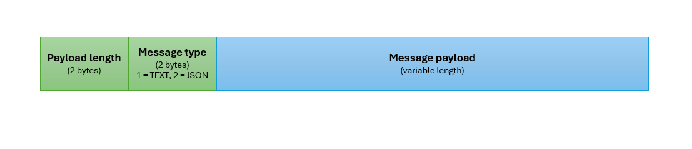

# TCP/UDP Demos

## Intruduction
This directory contains a set of applications serving as demonstration of TCP and UDP communication. Particular applications are described by the subsequent sections of this document. All applications use some reusable functions provided by the [commons.py](./commons.py) module which also encapsulates the socket API. The following diagram illustrates the PDU structure used by the communication, which is the same for TCP and UDP. The header consists of just two fields - payload length and message type.

3rd party dependencies which must be installed are listed in the [reuirements.txt](./requirements.txt) file. All **applications are self-documented concerning the command line arguments**. In other words, if you start any of the applications with the `-h` or `--help` switch, you will get instructions how to start the application.

## TCP Unicast Communication
Demonstration of TCP communication.  
Applications:
* [tcp_server.py](./tcp_server.py) is a multi-threaded TCP server which opens a TCP socket in listening mode and accepts incoming connections. For each connection, a new worker thread is started (thread-per-connection model). The worker reads text messages from its TCP connection and sends answers to those messages. The server must be started before any client will try to connect to it.
* [tcp_client.py](./tcp_client.py) is a TCP client which establishes a TCP connection to the given IP address and TCP port. In addition, it repeatedly sends text messages to the TCP connections, and it reads answers to those messages.

The server application uses colors to distinguish messages from different clients. When starting the client application, you can specify the name of the client. The name is included in the messages sent to the server. If you start two or more simultaneous clients, each with a different name, the names are visible in the server’s output. The colors and the client names make it easy to distinguish which client is communicating at any given moment (see the screenshots below).

## TCP Window Size Zero Indication Demo
Demonstration of TCP communication with window size zero indication.  
Applications:
* [hesitant_consumer_tcp_server.py](./hesitant_consumer_tcp_server.py) is a simple TCP server that accepts single incoming TCP connection. However, it does not read any data/messages from the TCP connection, so can be used to demonstrate the window size zero indication. The server must be started before any client will try to connect to it.
* [eager_producer_tcp_client.py](./eager_producer_tcp_client.py) is a simple TCP client that establishes a TCP connection to the given IP address and TCP port, and it periodically sends some random data over the TCP connection.

## UDP Unicast Communication
Demonstration of unicast UDP communication.  
Applications:
* [udp_server.py](./udp_server.py) is a UDP server which opens a UDP port in listening mode. After opening the port, it ready to receive and answer text messages from UDP clients. The server should be started before any clients will send messages to it.
* [udp_client.py](./udp_client.py) is a UDP client which repeatedly sends text messages to the given IP address and UDP port.

## UDP Broadcast Communication
Demonstration of UDP broadcast communication.  
Applications:
* [broadcast_udp_publisher.py](./broadcast_udp_publisher.py) repeatedly publishes text messages to the specified broadcast IP address and UDP port.
* [broadcast_udp_consumer.py](./broadcast_udp_consumer.py) repeatedly consumes text messages from the specified IP address and UDP port.

## Multicast Communication
Demonstration of UDP multicast communication.  
Applications:
* [multicast_publisher.py](./multicast_publisher.py) repeatedly publishes text messages to the specified multicast IP address and UDP port.
* [multicast_subscriber.py](./multicast_subscriber.py) repeatedly consumes text messages from the specified multicast IP address and UDP port.
